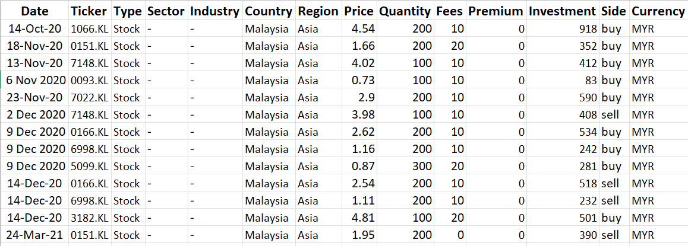
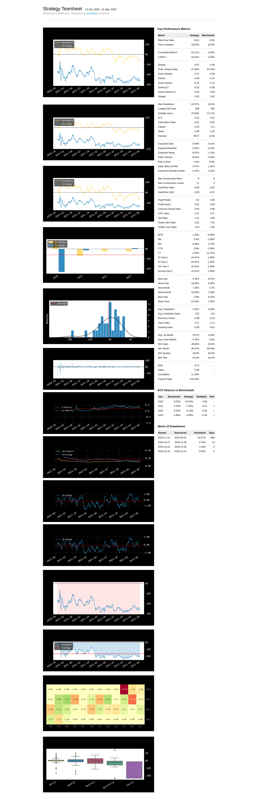

# Build a Tearsheet for your portfolio within 10 lines of code

This portfolio tearsheet is mainly generated using 2 libraries, `openbb` and `quantstats`

- Used `openbb.portfolio.load` to load my transactions data from excel file: [portfolio_data.xlsx](./input/portfolio_data.xlsx) and then calculate my portfolio return
- Used `quantstats.reports.html` to generate a tearsheet for my portfolio. See the output here: [Portfolio tearsheet](./output/quantstats-tearsheet.html)

So, if you want to reuse this template, just merely change this two input:
(1) data inside excel file [here](./input/portfolio_data.xlsx):

(2) benchmark symbol you want to compare with

But, take note that the data source is from Yahoo Finance, so please refer the ticker symbol saved t

