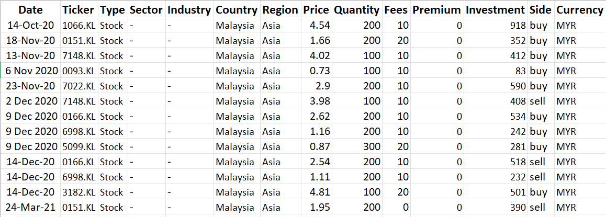
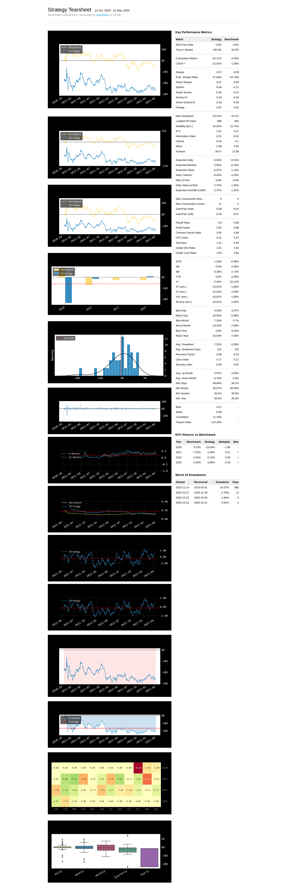

# Build a Tearsheet for your portfolio within 10 lines of code

## Overview
This portfolio tearsheet is mainly generated using 2 libraries, `openbb` and `quantstats`

- Used `openbb.portfolio.load` to load my transactions data from excel file: [portfolio_data.xlsx](./input/portfolio_data.xlsx) and then calculate my portfolio return
- Used `quantstats.reports.html` to generate a tearsheet for my portfolio. See the output here: [Portfolio tearsheet](./portfolio/2. KPI & benchmark/KPI_and_benchmark.ipynb)

So, if you want to reuse this template, just merely change this two input:

1. data inside excel file [here](./input/portfolio_data.xlsx):

2. benchmark symbol you want to compare with

But, take note that the data source is from Yahoo Finance, so when you want to change the stock ticker in excel file, please refer that ticker symbol in Yahoo Finance.

Limitations:
- didn't include dividends when calculating dividends

List of some other interesting finance github repo to look on:
- https://github.com/dylanhogg/awesome-python#finance
- quantlib: http://gouthamanbalaraman.com/blog/quantlib-python-tutorials-with-examples.html & quantlib book: https://leanpub.com/quantlibpythoncookbook
